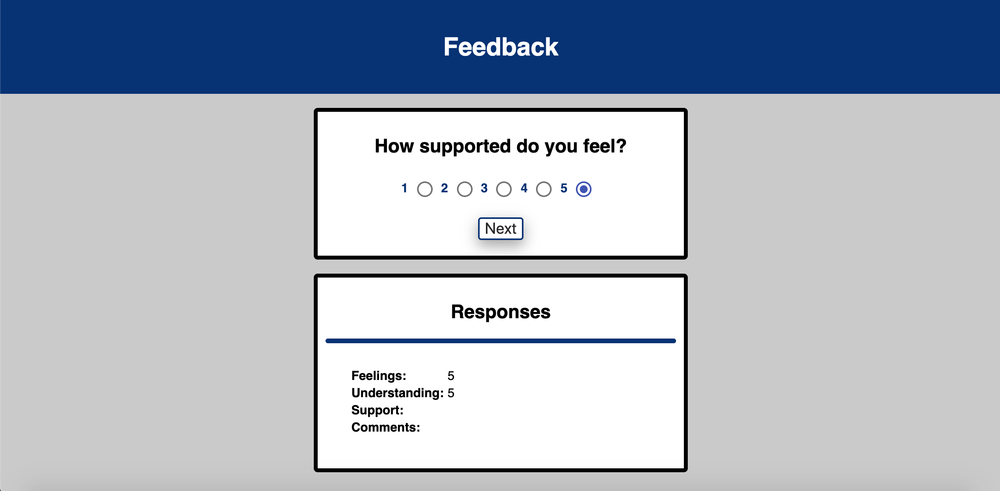

# Feedback App
The feedback app - giving students a chance to express how things are going for them. Students receiving this multi-paged feedback form will be able to rank their levels of different aspects of the program from 1-5, and leave any comments. This information is stored in a database for instructors to reference. 

## Built With
- JavaScript
- React.js
- Redux 
- Node.js
- SQL 
- JSX/CSS

## Prerequisites
- 1) Node.js 
- 2) postgresql 

## Getting the environmnent up and running 

Interact with the app here: 
https://guarded-crag-60418.herokuapp.com/#/

OR 

- 1) Clone/Download Repository 
- 2) Open project in preferred code editor
- 3) Open terminal, npm install 
- 4) Open two terminal tabs:
- 5) - in first, npm start
- 6) - in second, npm run client

## Screen Shot

## Completed Features
- multipaged/routed app with three 4 aspects of feedback 
- 1) Feeliing
- 2) Understanding 
- 3) Support 
- 4) Comments 
- User has the ability to rank their levels of the first 3 aspects from 1-5
- User has to add comments to submit their feedback 
- All feedback information is stored in database 
- User can leave new feedback at the end of the form 